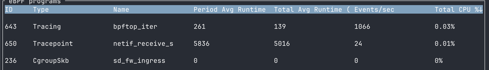
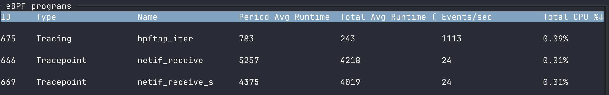

# Overview
Re-implementing [Brendan Gregg](https://www.brendangregg.com/)'s `bpftrace` networking 1 liner showing the `rx packets distribution per device / cpu` using Rust / [Aya](https://aya-rs.dev/)

Original script and output:

```bash
sudo bpftrace -e 't:net:netif_receive_skb { @[str(args->name)] = lhist(cpu, 0, 128, 1); }'
Attaching 1 probe...
^C

@[lo]:
[0, 1)                 3 |@@@@@@@@@@@@@@@@@@@@@@@@@@@@@@@                     |
[1, 2)                 4 |@@@@@@@@@@@@@@@@@@@@@@@@@@@@@@@@@@@@@@@@@           |
[2, 3)                 0 |                                                    |
[3, 4)                 0 |                                                    |
[4, 5)                 2 |@@@@@@@@@@@@@@@@@@@@                                |
[5, 6)                 5 |@@@@@@@@@@@@@@@@@@@@@@@@@@@@@@@@@@@@@@@@@@@@@@@@@@@@|

@[eth0]:
[0, 1)                80 |@@@@@@@@@@@@@@@@@@@@@@@@@@@@@@@@@@@@@@@@@@@@@@@@@@@@|
```

# Motivation

While testing the bpftrace script with [bpftop](https://github.com/Netflix/bpftop), I noticed an high cpu per invocation (_netif_receive_s_):



_Period / Total Avg Runtime_  is expressed in _nanoseconds_.

Knowing little about bpftrace, llvm and ebpf code generation, the question was: would rewriting the 1-liner with a different tool (libbpf or aya), improve its performance?

Answer: `no` :)

The aya implementation (_netif_receive_) performs as the bpftrace implementation (_netif_receive_s_)


# Details

The 1-liner intercepts the linux kernel [netif_receive_skb](https://elixir.bootlin.com/linux/v6.15/source/net/core/dev.c#L6124) function, invoked at an early stage of the packet processing flow:
```
netif_receive_skb - process receive buffer from network
 *	@skb: buffer to process
 *
 *	netif_receive_skb() is the main receive data processing function.
 *  [...]
 *
 *	This function may only be called from softirq context and interrupts
 *	should be enabled.
 ```

The script has been mostly reimplemented in Rust / aya, yielding the following output:

```bash
sudo ./target/debug/netif-receive
Waiting for Ctrl-C...
^C
@["eth0"]
|0              32|
|1              0|
|2              0|
|3              0|
|4              0|
|5              0|
@["lo"]
|0              16|
|1              2|
|2              2|
|3              23|
|4              0|
|5              1|
```

Please note, instead of implementing an histogram, it's a simple counter - how many times a packet is received by a core, per device.

In an ideal world, we would display the byte code for both ebpf programs and discuss the differences.

We'll live this exercise for another time.

## How to display ebpf bytecodes
```> sudo bpftool prog list```

```bash
666: tracepoint  name netif_receive  tag d8c808f0bbb70000  gpl run_time_ns 532636090 run_cnt 168956
        loaded_at 2025-05-27T19:22:00+0100  uid 0
        xlated 2200B  jited 1328B  memlock 4096B  map_ids 500,498,501,499,502
669: tracepoint  name tracepoint_net_netif_receive_skb_1  tag decd72490daaa442  gpl run_time_ns 513026870 run_cnt 168959
        loaded_at 2025-05-27T19:22:03+0100  uid 0
        xlated 2960B  jited 1688B  memlock 4096B  map_ids 508,505
        btf_id 660
```

```> sudo bpftool prog dump xlated id <prog_id>```


<details>
<summary> 1 liner ebpf byte code</summary>

```
int64 tracepoint_net_netif_receive_skb_1(int8 * ctx):
   0: (bf) r6 = r1
   1: (85) call bpf_get_smp_processor_id#8
   2: (85) call bpf_get_smp_processor_id#8
   3: (b7) r7 = 0
   4: (b7) r8 = 0
   5: (6d) if r7 s> r0 goto pc+4
   6: (b7) r8 = 129
   7: (65) if r0 s> 0x80 goto pc+2
   8: (07) r0 += 1
   9: (bf) r8 = r0
  10: (63) *(u32 *)(r10 -8) = r7
  11: (bf) r2 = r10
  12: (07) r2 += -8
  13: (18) r1 = map[id:508]
  15: (07) r1 += 264
  16: (61) r0 = *(u32 *)(r2 +0)
  17: (35) if r0 >= 0x1 goto pc+5
  18: (67) r0 <<= 3
  19: (0f) r0 += r1
  20: (79) r0 = *(u64 *)(r0 +0)
  21: (bf) r0 = &(void __percpu *)(r0)
  22: (05) goto pc+1
  23: (b7) r0 = 0
  24: (55) if r0 != 0x0 goto pc+2
  25: (bf) r0 = r7
  26: (95) exit
  27: (b7) r1 = 0
  28: (73) *(u8 *)(r0 +63) = r1
  29: (73) *(u8 *)(r0 +62) = r1
  30: (73) *(u8 *)(r0 +61) = r1
  31: (73) *(u8 *)(r0 +60) = r1
  32: (73) *(u8 *)(r0 +59) = r1
  33: (73) *(u8 *)(r0 +58) = r1
  34: (73) *(u8 *)(r0 +57) = r1
  35: (73) *(u8 *)(r0 +56) = r1
  36: (73) *(u8 *)(r0 +55) = r1
  37: (73) *(u8 *)(r0 +54) = r1
  38: (73) *(u8 *)(r0 +53) = r1
  39: (73) *(u8 *)(r0 +52) = r1
  40: (73) *(u8 *)(r0 +51) = r1
  41: (73) *(u8 *)(r0 +50) = r1
  42: (73) *(u8 *)(r0 +49) = r1
  43: (73) *(u8 *)(r0 +48) = r1
  44: (73) *(u8 *)(r0 +47) = r1
  45: (73) *(u8 *)(r0 +46) = r1
  46: (73) *(u8 *)(r0 +45) = r1
  47: (73) *(u8 *)(r0 +44) = r1
  48: (73) *(u8 *)(r0 +43) = r1
  49: (73) *(u8 *)(r0 +42) = r1
  50: (73) *(u8 *)(r0 +41) = r1
  51: (73) *(u8 *)(r0 +40) = r1
  52: (73) *(u8 *)(r0 +39) = r1
  53: (73) *(u8 *)(r0 +38) = r1
  54: (73) *(u8 *)(r0 +37) = r1
  55: (73) *(u8 *)(r0 +36) = r1
  56: (73) *(u8 *)(r0 +35) = r1
  57: (73) *(u8 *)(r0 +34) = r1
  58: (73) *(u8 *)(r0 +33) = r1
  59: (73) *(u8 *)(r0 +32) = r1
  60: (73) *(u8 *)(r0 +31) = r1
  61: (73) *(u8 *)(r0 +30) = r1
  62: (73) *(u8 *)(r0 +29) = r1
  63: (73) *(u8 *)(r0 +28) = r1
  64: (73) *(u8 *)(r0 +27) = r1
  65: (73) *(u8 *)(r0 +26) = r1
  66: (73) *(u8 *)(r0 +25) = r1
  67: (73) *(u8 *)(r0 +24) = r1
  68: (73) *(u8 *)(r0 +23) = r1
  69: (73) *(u8 *)(r0 +22) = r1
  70: (73) *(u8 *)(r0 +21) = r1
  71: (73) *(u8 *)(r0 +20) = r1
  72: (73) *(u8 *)(r0 +19) = r1
  73: (73) *(u8 *)(r0 +18) = r1
  74: (73) *(u8 *)(r0 +17) = r1
  75: (73) *(u8 *)(r0 +16) = r1
  76: (73) *(u8 *)(r0 +15) = r1
  77: (73) *(u8 *)(r0 +14) = r1
  78: (73) *(u8 *)(r0 +13) = r1
  79: (73) *(u8 *)(r0 +12) = r1
  80: (73) *(u8 *)(r0 +11) = r1
  81: (73) *(u8 *)(r0 +10) = r1
  82: (73) *(u8 *)(r0 +9) = r1
  83: (73) *(u8 *)(r0 +8) = r1
  84: (73) *(u8 *)(r0 +7) = r1
  85: (73) *(u8 *)(r0 +6) = r1
  86: (73) *(u8 *)(r0 +5) = r1
  87: (73) *(u8 *)(r0 +4) = r1
  88: (73) *(u8 *)(r0 +3) = r1
  89: (73) *(u8 *)(r0 +2) = r1
  90: (73) *(u8 *)(r0 +1) = r1
  91: (73) *(u8 *)(r0 +0) = r1
  92: (61) r3 = *(u32 *)(r6 +20)
  93: (57) r3 &= 65535
  94: (0f) r3 += r6
  95: (bf) r1 = r0
  96: (b7) r2 = 64
  97: (bf) r6 = r0
  98: (85) call bpf_probe_read_kernel_str#-133224
  99: (71) r2 = *(u8 *)(r6 +9)
 100: (67) r2 <<= 8
 101: (71) r1 = *(u8 *)(r6 +8)
 102: (4f) r2 |= r1
 103: (7b) *(u64 *)(r10 -208) = r2
 104: (71) r2 = *(u8 *)(r6 +1)
 105: (67) r2 <<= 8
 106: (71) r1 = *(u8 *)(r6 +0)
 107: (4f) r2 |= r1
 108: (7b) *(u64 *)(r10 -136) = r2
 109: (71) r2 = *(u8 *)(r6 +37)
 110: (67) r2 <<= 8
 111: (71) r1 = *(u8 *)(r6 +36)
 112: (4f) r2 |= r1
 113: (7b) *(u64 *)(r10 -144) = r2
 114: (71) r2 = *(u8 *)(r6 +29)
 115: (67) r2 <<= 8
 116: (71) r1 = *(u8 *)(r6 +28)
 117: (4f) r2 |= r1
 118: (7b) *(u64 *)(r10 -152) = r2
 119: (71) r2 = *(u8 *)(r6 +21)
 120: (67) r2 <<= 8
 121: (71) r1 = *(u8 *)(r6 +20)
 122: (4f) r2 |= r1
 123: (7b) *(u64 *)(r10 -128) = r2
 124: (71) r2 = *(u8 *)(r6 +13)
 125: (67) r2 <<= 8
 126: (71) r1 = *(u8 *)(r6 +12)
 127: (4f) r2 |= r1
 128: (7b) *(u64 *)(r10 -168) = r2
 129: (71) r2 = *(u8 *)(r6 +5)
 130: (67) r2 <<= 8
 131: (71) r1 = *(u8 *)(r6 +4)
 132: (4f) r2 |= r1
 133: (7b) *(u64 *)(r10 -192) = r2
 134: (71) r2 = *(u8 *)(r6 +49)
 135: (67) r2 <<= 8
 136: (71) r1 = *(u8 *)(r6 +48)
 137: (4f) r2 |= r1
 138: (7b) *(u64 *)(r10 -160) = r2
 139: (71) r1 = *(u8 *)(r6 +50)
 140: (67) r1 <<= 16
 141: (71) r2 = *(u8 *)(r6 +51)
 142: (67) r2 <<= 24
 143: (4f) r2 |= r1
 144: (7b) *(u64 *)(r10 -176) = r2
 145: (71) r2 = *(u8 *)(r6 +41)
 146: (67) r2 <<= 8
 147: (71) r1 = *(u8 *)(r6 +40)
 148: (4f) r2 |= r1
 149: (7b) *(u64 *)(r10 -200) = r2
 150: (71) r1 = *(u8 *)(r6 +42)
 151: (67) r1 <<= 16
 152: (71) r2 = *(u8 *)(r6 +43)
 153: (67) r2 <<= 24
 154: (4f) r2 |= r1
 155: (7b) *(u64 *)(r10 -104) = r2
 156: (71) r2 = *(u8 *)(r6 +33)
 157: (67) r2 <<= 8
 158: (71) r1 = *(u8 *)(r6 +32)
 159: (4f) r2 |= r1
 160: (7b) *(u64 *)(r10 -216) = r2
 161: (71) r1 = *(u8 *)(r6 +34)
 162: (67) r1 <<= 16
 163: (71) r2 = *(u8 *)(r6 +35)
 164: (67) r2 <<= 24
 165: (4f) r2 |= r1
 166: (7b) *(u64 *)(r10 -88) = r2
 167: (71) r2 = *(u8 *)(r6 +25)
 168: (67) r2 <<= 8
 169: (71) r1 = *(u8 *)(r6 +24)
 170: (4f) r2 |= r1
 171: (7b) *(u64 *)(r10 -224) = r2
 172: (71) r1 = *(u8 *)(r6 +26)
 173: (67) r1 <<= 16
 174: (71) r2 = *(u8 *)(r6 +27)
 175: (67) r2 <<= 24
 176: (4f) r2 |= r1
 177: (7b) *(u64 *)(r10 -96) = r2
 178: (71) r2 = *(u8 *)(r6 +17)
 179: (67) r2 <<= 8
 180: (71) r1 = *(u8 *)(r6 +16)
 181: (4f) r2 |= r1
 182: (7b) *(u64 *)(r10 -232) = r2
 183: (71) r1 = *(u8 *)(r6 +18)
 184: (67) r1 <<= 16
 185: (71) r2 = *(u8 *)(r6 +19)
 186: (67) r2 <<= 24
 187: (4f) r2 |= r1
 188: (7b) *(u64 *)(r10 -120) = r2
 189: (71) r1 = *(u8 *)(r6 +10)
 190: (67) r1 <<= 16
 191: (71) r0 = *(u8 *)(r6 +11)
 192: (67) r0 <<= 24
 193: (4f) r0 |= r1
 194: (71) r1 = *(u8 *)(r6 +2)
 195: (67) r1 <<= 16
 196: (7b) *(u64 *)(r10 -184) = r8
 197: (71) r2 = *(u8 *)(r6 +3)
 198: (67) r2 <<= 24
 199: (4f) r2 |= r1
 200: (7b) *(u64 *)(r10 -112) = r2
 201: (71) r1 = *(u8 *)(r6 +38)
 202: (67) r1 <<= 16
 203: (71) r8 = *(u8 *)(r6 +39)
 204: (67) r8 <<= 24
 205: (4f) r8 |= r1
 206: (71) r1 = *(u8 *)(r6 +30)
 207: (67) r1 <<= 16
 208: (71) r9 = *(u8 *)(r6 +31)
 209: (67) r9 <<= 24
 210: (4f) r9 |= r1
 211: (71) r1 = *(u8 *)(r6 +22)
 212: (67) r1 <<= 16
 213: (71) r5 = *(u8 *)(r6 +23)
 214: (67) r5 <<= 24
 215: (4f) r5 |= r1
 216: (71) r1 = *(u8 *)(r6 +14)
 217: (67) r1 <<= 16
 218: (71) r7 = *(u8 *)(r6 +15)
 219: (67) r7 <<= 24
 220: (4f) r7 |= r1
 221: (71) r1 = *(u8 *)(r6 +6)
 222: (67) r1 <<= 16
 223: (71) r4 = *(u8 *)(r6 +7)
 224: (67) r4 <<= 24
 225: (4f) r4 |= r1
 226: (71) r1 = *(u8 *)(r6 +45)
 227: (67) r1 <<= 8
 228: (71) r2 = *(u8 *)(r6 +44)
 229: (4f) r1 |= r2
 230: (71) r2 = *(u8 *)(r6 +46)
 231: (67) r2 <<= 16
 232: (71) r3 = *(u8 *)(r6 +47)
 233: (67) r3 <<= 24
 234: (4f) r3 |= r2
 235: (4f) r3 |= r1
 236: (79) r1 = *(u64 *)(r10 -192)
 237: (4f) r4 |= r1
 238: (79) r1 = *(u64 *)(r10 -168)
 239: (4f) r7 |= r1
 240: (79) r1 = *(u64 *)(r10 -128)
 241: (4f) r5 |= r1
 242: (7b) *(u64 *)(r10 -128) = r5
 243: (79) r1 = *(u64 *)(r10 -152)
 244: (4f) r9 |= r1
 245: (79) r1 = *(u64 *)(r10 -144)
 246: (4f) r8 |= r1
 247: (79) r1 = *(u64 *)(r10 -136)
 248: (79) r2 = *(u64 *)(r10 -112)
 249: (4f) r2 |= r1
 250: (7b) *(u64 *)(r10 -112) = r2
 251: (79) r1 = *(u64 *)(r10 -208)
 252: (4f) r0 |= r1
 253: (7b) *(u64 *)(r10 -136) = r0
 254: (79) r1 = *(u64 *)(r10 -232)
 255: (79) r2 = *(u64 *)(r10 -120)
 256: (4f) r2 |= r1
 257: (7b) *(u64 *)(r10 -120) = r2
 258: (79) r1 = *(u64 *)(r10 -96)
 259: (79) r2 = *(u64 *)(r10 -224)
 260: (4f) r1 |= r2
 261: (7b) *(u64 *)(r10 -96) = r1
 262: (79) r1 = *(u64 *)(r10 -88)
 263: (79) r2 = *(u64 *)(r10 -216)
 264: (4f) r1 |= r2
 265: (7b) *(u64 *)(r10 -88) = r1
 266: (79) r1 = *(u64 *)(r10 -200)
 267: (79) r2 = *(u64 *)(r10 -104)
 268: (4f) r2 |= r1
 269: (7b) *(u64 *)(r10 -104) = r2
 270: (79) r0 = *(u64 *)(r10 -176)
 271: (79) r1 = *(u64 *)(r10 -160)
 272: (4f) r0 |= r1
 273: (71) r2 = *(u8 *)(r6 +53)
 274: (67) r2 <<= 8
 275: (71) r1 = *(u8 *)(r6 +52)
 276: (4f) r2 |= r1
 277: (71) r5 = *(u8 *)(r6 +54)
 278: (67) r5 <<= 16
 279: (71) r1 = *(u8 *)(r6 +55)
 280: (67) r1 <<= 24
 281: (4f) r1 |= r5
 282: (4f) r1 |= r2
 283: (67) r1 <<= 32
 284: (4f) r1 |= r0
 285: (67) r3 <<= 32
 286: (79) r2 = *(u64 *)(r10 -104)
 287: (4f) r3 |= r2
 288: (67) r8 <<= 32
 289: (79) r2 = *(u64 *)(r10 -88)
 290: (4f) r8 |= r2
 291: (7b) *(u64 *)(r10 -88) = r8
 292: (67) r9 <<= 32
 293: (79) r2 = *(u64 *)(r10 -96)
 294: (4f) r9 |= r2
 295: (7b) *(u64 *)(r10 -96) = r9
 296: (79) r2 = *(u64 *)(r10 -128)
 297: (67) r2 <<= 32
 298: (79) r5 = *(u64 *)(r10 -120)
 299: (4f) r2 |= r5
 300: (7b) *(u64 *)(r10 -128) = r2
 301: (67) r7 <<= 32
 302: (79) r2 = *(u64 *)(r10 -136)
 303: (4f) r7 |= r2
 304: (67) r4 <<= 32
 305: (79) r2 = *(u64 *)(r10 -112)
 306: (4f) r4 |= r2
 307: (71) r2 = *(u8 *)(r6 +57)
 308: (67) r2 <<= 8
 309: (71) r5 = *(u8 *)(r6 +56)
 310: (4f) r2 |= r5
 311: (71) r5 = *(u8 *)(r6 +58)
 312: (67) r5 <<= 16
 313: (71) r8 = *(u8 *)(r6 +59)
 314: (67) r8 <<= 24
 315: (4f) r8 |= r5
 316: (71) r9 = *(u8 *)(r6 +63)
 317: (71) r5 = *(u8 *)(r6 +62)
 318: (71) r0 = *(u8 *)(r6 +60)
 319: (7b) *(u64 *)(r10 -104) = r0
 320: (71) r6 = *(u8 *)(r6 +61)
 321: (79) r0 = *(u64 *)(r10 -184)
 322: (7b) *(u64 *)(r10 -16) = r0
 323: (7b) *(u64 *)(r10 -80) = r4
 324: (7b) *(u64 *)(r10 -72) = r7
 325: (79) r4 = *(u64 *)(r10 -128)
 326: (7b) *(u64 *)(r10 -64) = r4
 327: (79) r4 = *(u64 *)(r10 -96)
 328: (7b) *(u64 *)(r10 -56) = r4
 329: (79) r4 = *(u64 *)(r10 -88)
 330: (7b) *(u64 *)(r10 -48) = r4
 331: (7b) *(u64 *)(r10 -40) = r3
 332: (7b) *(u64 *)(r10 -32) = r1
 333: (4f) r8 |= r2
 334: (67) r6 <<= 8
 335: (79) r1 = *(u64 *)(r10 -104)
 336: (4f) r6 |= r1
 337: (67) r5 <<= 16
 338: (67) r9 <<= 24
 339: (4f) r9 |= r5
 340: (4f) r9 |= r6
 341: (67) r9 <<= 32
 342: (4f) r9 |= r8
 343: (7b) *(u64 *)(r10 -24) = r9
 344: (bf) r2 = r10
 345: (07) r2 += -80
 346: (18) r1 = map[id:505]
 348: (85) call __htab_map_lookup_elem#354352
 349: (15) if r0 == 0x0 goto pc+3
 350: (07) r0 += 120
 351: (79) r0 = *(u64 *)(r0 +0)
 352: (bf) r0 = &(void __percpu *)(r0)
 353: (15) if r0 == 0x0 goto pc+5
 354: (79) r1 = *(u64 *)(r0 +0)
 355: (07) r1 += 1
 356: (7b) *(u64 *)(r0 +0) = r1
 357: (b7) r7 = 1
 358: (05) goto pc-334
 359: (b7) r7 = 1
 360: (7b) *(u64 *)(r10 -8) = r7
 361: (bf) r2 = r10
 362: (07) r2 += -80
 363: (bf) r3 = r10
 364: (07) r3 += -8
 365: (18) r1 = map[id:505]
 367: (b7) r4 = 1
 368: (85) call htab_percpu_map_update_elem#379072
 369: (05) goto pc-345
 ```
</details>

<details>

<summary> aya ebpf byte code</summary>

```
   0: (bf) r6 = r1
   1: (bf) r3 = r6
   2: (07) r3 += 24
   3: (bf) r1 = r10
   4: (07) r1 += -4
   5: (b7) r2 = 4
   6: (85) call bpf_probe_read_compat#-128760
   7: (15) if r0 == 0x0 goto pc+241
   8: (b7) r7 = 0
   9: (63) *(u32 *)(r10 -8) = r7
  10: (bf) r2 = r10
  11: (07) r2 += -8
  12: (18) r1 = map[id:500]
  14: (07) r1 += 264
  15: (61) r0 = *(u32 *)(r2 +0)
  16: (35) if r0 >= 0x1 goto pc+5
  17: (67) r0 <<= 3
  18: (0f) r0 += r1
  19: (79) r0 = *(u64 *)(r0 +0)
  20: (bf) r0 = &(void __percpu *)(r0)
  21: (05) goto pc+1
  22: (b7) r0 = 0
  23: (15) if r0 == 0x0 goto pc+249
  24: (73) *(u8 *)(r0 +2) = r7
  25: (b7) r2 = 13
  26: (73) *(u8 *)(r0 +1) = r2
  27: (b7) r1 = 1
  28: (73) *(u8 *)(r0 +0) = r1
  29: (bf) r3 = r0
  30: (07) r3 += 3
  31: (18) r4 = map[id:498][0]+22
  33: (71) r5 = *(u8 *)(r4 +0)
  34: (73) *(u8 *)(r3 +0) = r5
  35: (71) r5 = *(u8 *)(r4 +1)
  36: (73) *(u8 *)(r3 +1) = r5
  37: (71) r5 = *(u8 *)(r4 +2)
  38: (73) *(u8 *)(r3 +2) = r5
  39: (71) r5 = *(u8 *)(r4 +3)
  40: (73) *(u8 *)(r3 +3) = r5
  41: (71) r5 = *(u8 *)(r4 +4)
  42: (73) *(u8 *)(r3 +4) = r5
  43: (71) r5 = *(u8 *)(r4 +5)
  44: (73) *(u8 *)(r3 +5) = r5
  45: (71) r5 = *(u8 *)(r4 +6)
  46: (73) *(u8 *)(r3 +6) = r5
  47: (71) r5 = *(u8 *)(r4 +7)
  48: (73) *(u8 *)(r3 +7) = r5
  49: (71) r5 = *(u8 *)(r4 +8)
  50: (73) *(u8 *)(r3 +8) = r5
  51: (71) r5 = *(u8 *)(r4 +9)
  52: (73) *(u8 *)(r3 +9) = r5
  53: (71) r5 = *(u8 *)(r4 +10)
  54: (73) *(u8 *)(r3 +10) = r5
  55: (71) r5 = *(u8 *)(r4 +11)
  56: (73) *(u8 *)(r3 +11) = r5
  57: (71) r5 = *(u8 *)(r4 +12)
  58: (73) *(u8 *)(r3 +12) = r5
  59: (73) *(u8 *)(r0 +21) = r2
  60: (b7) r2 = 3
  61: (73) *(u8 *)(r0 +20) = r2
  62: (b7) r2 = 2
  63: (73) *(u8 *)(r0 +16) = r2
  64: (73) *(u8 *)(r0 +22) = r7
  65: (73) *(u8 *)(r0 +18) = r7
  66: (73) *(u8 *)(r0 +17) = r1
  67: (73) *(u8 *)(r0 +19) = r1
  68: (bf) r2 = r0
  69: (07) r2 += 23
  70: (71) r3 = *(u8 *)(r4 +0)
  71: (73) *(u8 *)(r2 +0) = r3
  72: (71) r3 = *(u8 *)(r4 +1)
  73: (73) *(u8 *)(r2 +1) = r3
  74: (71) r3 = *(u8 *)(r4 +2)
  75: (73) *(u8 *)(r2 +2) = r3
  76: (71) r3 = *(u8 *)(r4 +3)
  77: (73) *(u8 *)(r2 +3) = r3
  78: (71) r3 = *(u8 *)(r4 +4)
  79: (73) *(u8 *)(r2 +4) = r3
  80: (71) r3 = *(u8 *)(r4 +5)
  81: (73) *(u8 *)(r2 +5) = r3
  82: (71) r3 = *(u8 *)(r4 +6)
  83: (73) *(u8 *)(r2 +6) = r3
  84: (71) r3 = *(u8 *)(r4 +7)
  85: (73) *(u8 *)(r2 +7) = r3
  86: (71) r3 = *(u8 *)(r4 +8)
  87: (73) *(u8 *)(r2 +8) = r3
  88: (71) r3 = *(u8 *)(r4 +9)
  89: (73) *(u8 *)(r2 +9) = r3
  90: (71) r3 = *(u8 *)(r4 +10)
  91: (73) *(u8 *)(r2 +10) = r3
  92: (71) r3 = *(u8 *)(r4 +11)
  93: (73) *(u8 *)(r2 +11) = r3
  94: (71) r3 = *(u8 *)(r4 +12)
  95: (73) *(u8 *)(r2 +12) = r3
  96: (b7) r2 = 30
  97: (73) *(u8 *)(r0 +37) = r2
  98: (73) *(u8 *)(r0 +38) = r7
  99: (b7) r2 = 4
 100: (73) *(u8 *)(r0 +36) = r2
 101: (bf) r3 = r0
 102: (07) r3 += 39
 103: (18) r4 = map[id:498][0]+35
 105: (71) r5 = *(u8 *)(r4 +0)
 106: (73) *(u8 *)(r3 +0) = r5
 107: (71) r5 = *(u8 *)(r4 +1)
 108: (73) *(u8 *)(r3 +1) = r5
 109: (71) r5 = *(u8 *)(r4 +2)
 110: (73) *(u8 *)(r3 +2) = r5
 111: (71) r5 = *(u8 *)(r4 +3)
 112: (73) *(u8 *)(r3 +3) = r5
 113: (71) r5 = *(u8 *)(r4 +4)
 114: (73) *(u8 *)(r3 +4) = r5
 115: (71) r5 = *(u8 *)(r4 +5)
 116: (73) *(u8 *)(r3 +5) = r5
 117: (71) r5 = *(u8 *)(r4 +6)
 118: (73) *(u8 *)(r3 +6) = r5
 119: (71) r5 = *(u8 *)(r4 +7)
 120: (73) *(u8 *)(r3 +7) = r5
 121: (71) r5 = *(u8 *)(r4 +8)
 122: (73) *(u8 *)(r3 +8) = r5
 123: (71) r5 = *(u8 *)(r4 +9)
 124: (73) *(u8 *)(r3 +9) = r5
 125: (71) r5 = *(u8 *)(r4 +10)
 126: (73) *(u8 *)(r3 +10) = r5
 127: (71) r5 = *(u8 *)(r4 +11)
 128: (73) *(u8 *)(r3 +11) = r5
 129: (71) r5 = *(u8 *)(r4 +12)
 130: (73) *(u8 *)(r3 +12) = r5
 131: (71) r5 = *(u8 *)(r4 +13)
 132: (73) *(u8 *)(r3 +13) = r5
 133: (71) r5 = *(u8 *)(r4 +14)
 134: (73) *(u8 *)(r3 +14) = r5
 135: (71) r5 = *(u8 *)(r4 +15)
 136: (73) *(u8 *)(r3 +15) = r5
 137: (71) r5 = *(u8 *)(r4 +16)
 138: (73) *(u8 *)(r3 +16) = r5
 139: (71) r5 = *(u8 *)(r4 +17)
 140: (73) *(u8 *)(r3 +17) = r5
 141: (71) r5 = *(u8 *)(r4 +18)
 142: (73) *(u8 *)(r3 +18) = r5
 143: (71) r5 = *(u8 *)(r4 +19)
 144: (73) *(u8 *)(r3 +19) = r5
 145: (71) r5 = *(u8 *)(r4 +20)
 146: (73) *(u8 *)(r3 +20) = r5
 147: (71) r5 = *(u8 *)(r4 +21)
 148: (73) *(u8 *)(r3 +21) = r5
 149: (71) r5 = *(u8 *)(r4 +22)
 150: (73) *(u8 *)(r3 +22) = r5
 151: (71) r5 = *(u8 *)(r4 +23)
 152: (73) *(u8 *)(r3 +23) = r5
 153: (71) r5 = *(u8 *)(r4 +24)
 154: (73) *(u8 *)(r3 +24) = r5
 155: (71) r5 = *(u8 *)(r4 +25)
 156: (73) *(u8 *)(r3 +25) = r5
 157: (71) r5 = *(u8 *)(r4 +26)
 158: (73) *(u8 *)(r3 +26) = r5
 159: (71) r5 = *(u8 *)(r4 +27)
 160: (73) *(u8 *)(r3 +27) = r5
 161: (71) r5 = *(u8 *)(r4 +28)
 162: (73) *(u8 *)(r3 +28) = r5
 163: (71) r5 = *(u8 *)(r4 +29)
 164: (73) *(u8 *)(r3 +29) = r5
 165: (b7) r3 = 22
 166: (73) *(u8 *)(r0 +88) = r3
 167: (73) *(u8 *)(r0 +79) = r1
 168: (b7) r1 = 8
 169: (73) *(u8 *)(r0 +77) = r1
 170: (b7) r1 = 57
 171: (73) *(u8 *)(r0 +72) = r1
 172: (73) *(u8 *)(r0 +89) = r7
 173: (73) *(u8 *)(r0 +86) = r7
 174: (73) *(u8 *)(r0 +85) = r7
 175: (73) *(u8 *)(r0 +84) = r7
 176: (73) *(u8 *)(r0 +83) = r7
 177: (73) *(u8 *)(r0 +82) = r7
 178: (73) *(u8 *)(r0 +81) = r7
 179: (73) *(u8 *)(r0 +80) = r7
 180: (73) *(u8 *)(r0 +78) = r7
 181: (73) *(u8 *)(r0 +75) = r7
 182: (73) *(u8 *)(r0 +74) = r7
 183: (73) *(u8 *)(r0 +73) = r7
 184: (73) *(u8 *)(r0 +71) = r7
 185: (73) *(u8 *)(r0 +70) = r2
 186: (b7) r1 = 20
 187: (73) *(u8 *)(r0 +87) = r1
 188: (b7) r1 = 6
 189: (73) *(u8 *)(r0 +76) = r1
 190: (b7) r1 = 5
 191: (73) *(u8 *)(r0 +69) = r1
 192: (bf) r1 = r0
 193: (07) r1 += 90
 194: (18) r2 = map[id:498][0]+0
 196: (71) r3 = *(u8 *)(r2 +0)
 197: (73) *(u8 *)(r1 +0) = r3
 198: (71) r3 = *(u8 *)(r2 +1)
 199: (73) *(u8 *)(r1 +1) = r3
 200: (71) r3 = *(u8 *)(r2 +2)
 201: (73) *(u8 *)(r1 +2) = r3
 202: (71) r3 = *(u8 *)(r2 +3)
 203: (73) *(u8 *)(r1 +3) = r3
 204: (71) r3 = *(u8 *)(r2 +4)
 205: (73) *(u8 *)(r1 +4) = r3
 206: (71) r3 = *(u8 *)(r2 +5)
 207: (73) *(u8 *)(r1 +5) = r3
 208: (71) r3 = *(u8 *)(r2 +6)
 209: (73) *(u8 *)(r1 +6) = r3
 210: (71) r3 = *(u8 *)(r2 +7)
 211: (73) *(u8 *)(r1 +7) = r3
 212: (71) r3 = *(u8 *)(r2 +8)
 213: (73) *(u8 *)(r1 +8) = r3
 214: (71) r3 = *(u8 *)(r2 +9)
 215: (73) *(u8 *)(r1 +9) = r3
 216: (71) r3 = *(u8 *)(r2 +10)
 217: (73) *(u8 *)(r1 +10) = r3
 218: (71) r3 = *(u8 *)(r2 +11)
 219: (73) *(u8 *)(r1 +11) = r3
 220: (71) r3 = *(u8 *)(r2 +12)
 221: (73) *(u8 *)(r1 +12) = r3
 222: (71) r3 = *(u8 *)(r2 +13)
 223: (73) *(u8 *)(r1 +13) = r3
 224: (71) r3 = *(u8 *)(r2 +14)
 225: (73) *(u8 *)(r1 +14) = r3
 226: (71) r3 = *(u8 *)(r2 +15)
 227: (73) *(u8 *)(r1 +15) = r3
 228: (71) r3 = *(u8 *)(r2 +16)
 229: (73) *(u8 *)(r1 +16) = r3
 230: (71) r3 = *(u8 *)(r2 +17)
 231: (73) *(u8 *)(r1 +17) = r3
 232: (71) r3 = *(u8 *)(r2 +18)
 233: (73) *(u8 *)(r1 +18) = r3
 234: (71) r3 = *(u8 *)(r2 +19)
 235: (73) *(u8 *)(r1 +19) = r3
 236: (71) r3 = *(u8 *)(r2 +20)
 237: (73) *(u8 *)(r1 +20) = r3
 238: (71) r3 = *(u8 *)(r2 +21)
 239: (73) *(u8 *)(r1 +21) = r3
 240: (bf) r1 = r6
 241: (18) r2 = map[id:501]
 243: (18) r3 = 0xffffffff
 245: (bf) r4 = r0
 246: (b7) r5 = 112
 247: (85) call bpf_perf_event_output_tp#-122776
 248: (05) goto pc+24
 249: (61) r1 = *(u32 *)(r10 -4)
 250: (63) *(u32 *)(r10 -12) = r1
 251: (bf) r2 = r10
 252: (07) r2 += -12
 253: (18) r1 = map[id:499]
 255: (85) call __htab_map_lookup_elem#354352
 256: (15) if r0 == 0x0 goto pc+3
 257: (07) r0 += 52
 258: (79) r0 = *(u64 *)(r0 +0)
 259: (bf) r0 = &(void __percpu *)(r0)
 260: (55) if r0 != 0x0 goto pc+9
 261: (bf) r2 = r10
 262: (07) r2 += -12
 263: (18) r1 = map[id:499]
 265: (18) r3 = map[id:502][0]+0
 267: (b7) r4 = 0
 268: (85) call htab_percpu_map_update_elem#379072
 269: (05) goto pc+3
 270: (61) r1 = *(u32 *)(r0 +0)
 271: (07) r1 += 1
 272: (63) *(u32 *)(r0 +0) = r1
 273: (b7) r0 = 0
 274: (95) exit
```

 </details>
